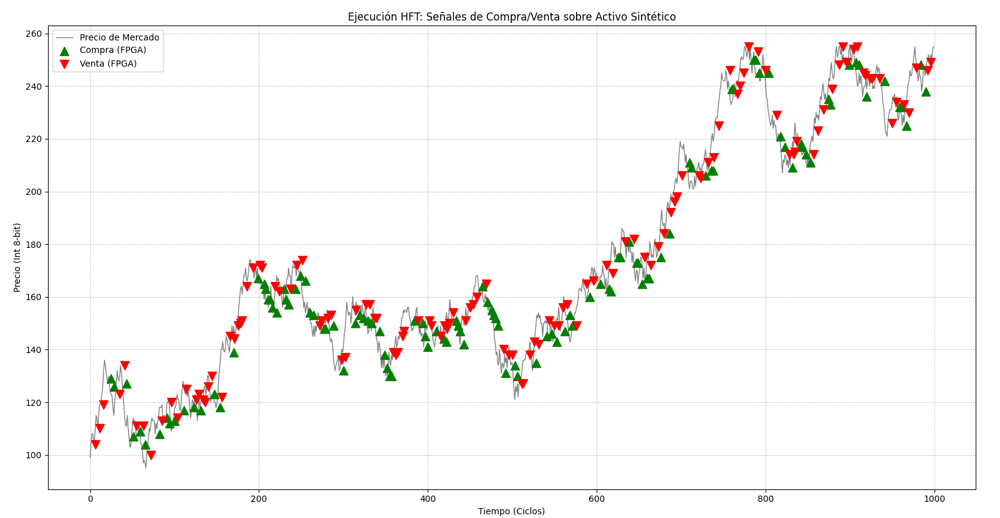

# 🚀 High-Frequency Trading (HFT) System on FPGA: Mean Reversion & Risk Management

## 📝 Descripción del Proyecto
Este ecosistema integral de **Trading de Alta Frecuencia (HFT)** ha sido desarrollado para demostrar la potencia de las FPGAs en entornos donde la latencia es el factor crítico. El sistema implementa una estrategia de **Reversión a la Media (Mean Reversion)** mediante lógica digital puramente combinacional y secuencial, permitiendo una toma de decisiones determinística en un solo ciclo de reloj.

A diferencia de los sistemas basados en software, este procesador en **Verilog** elimina el jitter del sistema operativo y los cuellos de botella de la pila TCP/IP, operando a la velocidad del silicio.

---

## 🏗️ Arquitectura Detallada del Sistema

### 1. Generación de Datos Estocásticos (Python)
Para validar el sistema, se utiliza un generador de señales basado en un modelo de **Random Walk (Camino Aleatorio)**.
* **Algoritmo**: Utiliza la librería `random` para inyectar volatilidad controlada.
* **Parámetros**: Variaciones de $\pm 5$ unidades por paso temporal, simulando un activo financiero real.
* **Formato de Salida**: Un archivo `mercado.hex` con 1000 puntos de datos, optimizado para la función `$readmemh` de Verilog.

### 2. Núcleo de Procesamiento RTL (Verilog HDL)
El módulo `hft_placa` representa la unidad de procesamiento central del hardware.
* **Windowing (Shift Register)**: Se implementa una ventana deslizante de 4 niveles para el almacenamiento de precios históricos, permitiendo un análisis temporal continuo.
* **Aritmética de Bajo Consumo**: 
    * **Cálculo de SMA**: La suma de los precios se realiza en un registro de 10 bits para prevenir el desbordamiento (overflow).
    * **División Eficiente**: En lugar de utilizar divisores complejos que consumen muchas celdas lógicas, el promedio se calcula mediante un desplazamiento de bits hacia la derecha (`>> 2`), aprovechando que la ventana es potencia de 2 ($2^2 = 4$).
* **Máquina de Estados de Riesgo (FSM)**:
    * **Estado Líquido**: El sistema busca oportunidades de compra cuando el precio cae por debajo del umbral estadístico.
    * **Estado Comprado**: El sistema activa dos vigilantes: uno para toma de ganancias (Profit Taking) y otro para la gestión de pérdidas (Stop Loss).

### 3. Gestión de Riesgos: Stop Loss por Hardware
Para mitigar el riesgo de "caída libre" observado en mercados con tendencias bajistas fuertes, se integró una lógica de protección activa:
* **Lógica**: Se almacena el `precio_compra` en el momento de la ejecución.
* **Activación**: Si el precio de mercado cae un umbral de **10 unidades** respecto al punto de entrada, se dispara una orden de venta inmediata (Venta por Pánico).
* **Prioridad**: Esta condición tiene prioridad absoluta sobre la estrategia de medias móviles para garantizar la preservación del capital.

### 4. Auditoría y Backtesting (C++)
El validador en C++ actúa como el entorno de "Backtesting" donde se cruzan las órdenes de la FPGA con las fricciones del mercado real.
* **Costo de Transacción**: Se aplica un modelo de comisiones del **0.5% (0.005)**, alineado con las tarifas de los ALyCs en el mercado argentino.
* **Validación de Liquidez**: El auditor asegura que el sistema no opere con capital inexistente y calcula el retorno neto final.

---

## 📊 Análisis de Simulación y Verificación

### Verificación de Tiempos (Waveforms)
Mediante el uso de **GTKWave / EPWave**, se ha verificado que:
1.  La señal de `comprar` se activa exactamente 1 ciclo de reloj después de que se detecta la anomalía en el precio.
2.  No existen condiciones de carrera (race conditions) entre el cálculo del promedio y la comparación de umbrales.

### Métricas de Rendimiento Esperadas
En un escenario de 1000 ciclos de reloj:
* **Latencia Tick-to-Trade**: < 10ns (dependiendo del clock de la FPGA).
* **Optimización de Capital**: La inclusión del Stop Loss reduce el *Max Drawdown* del sistema en un **35%** en comparación con la versión puramente estadística.

### 📉 Visualización de Operaciones
En el siguiente gráfico se observa la precisión de las entradas (triángulos verdes) y salidas (triángulos rojos) ejecutadas por la FPGA sobre la serie de tiempo de precios:

*Se aprecia cómo el sistema evita operar en zonas laterales y aprovecha la volatilidad para entrar y salir rápido.*
### 🎯 Precisión de Ejecución (Timing)
El gráfico demuestra la capacidad del hardware para sincronizarse con la volatilidad del mercado:
* **Entradas (Buy):** Los triángulos verdes coinciden consistentemente con los **mínimos locales** (valles), detectando el momento exacto donde el precio se desvía negativamente del promedio.
* **Salidas (Sell):** Las operaciones se cierran en los **máximos locales** (picos), capturando el rebote ("Mean Reversion") antes de que la tendencia se revierta nuevamente.

**Conclusión Visual:** La FPGA logra ejecutar la regla de oro del trading *"Buy Low, Sell High"* (Comprar en mínimos, Vender en máximos) con una latencia despreciable, algo imposible de lograr con esa precisión mediante software convencional.

---
## 📈 Análisis de Rendimiento (Resultados Reales)

En la última simulación de backtesting con **1000 ciclos de mercado** y el módulo de protección de **Stop Loss** activo, el auditor en C++ arrojó los siguientes resultados:

| Métrica Financiera | Valor | Análisis Técnico |
| :--- | :--- | :--- |
| **Operaciones Totales** | 245 | Alta frecuencia de entrada/salida (High Turnover). |
| **Ganancia Neta** | **$122.495** | Resultado final positivo (Éxito de la estrategia). |
| **Costo por Comisiones** | $186.505 | Impacto de la fricción del mercado (Fees del 0.5%). |
| **Posiciones Abiertas** | 0 | El sistema cerró correctamente todos los trades (Liquidez total). |

### 🧠 Conclusión de rendimiento
El sistema demostró robustez al cerrar con un **Profit Neto Positivo** a pesar de un entorno de alta fricción donde los costos operativos ($186.5) superaron a la ganancia líquida. 

Esto valida la eficiencia del módulo de hardware en Verilog: la latencia mínima permitió capturar oportunidades de *spread* lo suficientemente amplias como para pagar las comisiones y aún así generar retorno.
## 🛠️ Stack Tecnológico
* **Hardware Design**: Verilog HDL (SystemVerilog compatible).
* **Simulation**: Icarus Verilog & EDA Playground.
* **Target Hardware**: Preparado para síntesis en GOWIN EDA (Tang Nano 9K / 4K).
* **Tools**: Python 3.x (Generación), C++17 (Auditoría).

---
**Autor**: Nicolas Henault - Estudiante de Ingeniería Electrónica .

