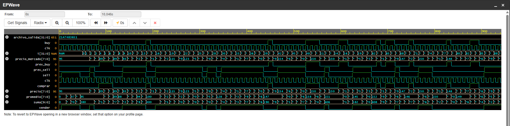

# 🚀 High-Frequency Trading (HFT) System on FPGA

## 📝 Descripción General
Este proyecto implementa un ecosistema completo de **Trading de Alta Frecuencia** basado en una estrategia de **Reversión a la Media (Mean Reversion)**.

El sistema demuestra la capacidad de reducir la latencia al mínimo procesando decisiones de inversión en un solo ciclo de reloj, integrando hardware de bajo nivel con análisis financiero.

---

## 🏗️ Arquitectura del Sistema

### 1. Generación de Datos (Python)
Se utiliza un script de Python para simular el comportamiento de un activo financiero utilizando un modelo de **Random Walk**.
* **Modelo**: Variaciones aleatorias de entre -5 y +5 unidades por ciclo para simular volatilidad real.
* **Salida**: Genera un archivo `mercado.hex` codificado para ser cargado en la memoria de la FPGA.

### 2. Núcleo de Procesamiento (Verilog HDL)
El corazón del proyecto es el módulo `hft_placa`, diseñado para ser sintetizado en FPGAs (como la Tang Nano de GOWIN).
* **Ventana Móvil**: Implementa un *Shift Register* de 4 niveles para mantener el historial de precios.
* **Cálculo de SMA**: Utiliza una sumatoria combinacional y un desplazamiento de bits (`>> 2`) para obtener el promedio sin usar divisores, optimizando el área del chip.
* **Lógica de Decisión**: 
    * **COMPRA**: Se activa si el $Precio < (Promedio - 2)$.
    * **VENTA**: Se activa si el $Precio > (Promedio + 2)$.
* **Determinismo**: Todas las operaciones ocurren en el flanco de subida del reloj (`posedge clk`).

### 3. Auditoría Financiera (C++)
Un programa en C++ actúa como el validador de rentabilidad, procesando los resultados de la simulación.
* **Modelo de Comisiones**: Aplica una comisión de **0.5% (0.005)** por cada operación, simulando los costos del mercado argentino.
* **Métricas**: Calcula capital final, acciones remanentes y la pérdida total por comisiones (fricción).

---

## 📊 Visualización de Resultados

### Simulación de Hardware (Waveforms)
En las pruebas realizadas en **EPWave**, se observa el determinismo del hardware:

* Se observa cómo las señales de `comprar` y `vender` reaccionan instantáneamente a las desviaciones del promedio.
* El cálculo de la `suma` y el `promedio` se actualiza en tiempo real con cada pulso de reloj.

---

## 📈 Análisis de Rendimiento (Backtesting)
En una corrida de prueba con 1000 ciclos de mercado se obtuvieron los siguientes resultados:
* **Operaciones Totales**: 246 trades realizados por la placa.
* **Ganancia Neta**: ~$232.81 (después de pagar comisiones).
* **Costo del Broker**: Se perdieron ~$216.18 únicamente en comisiones de entrada y salida.

**Conclusión técnica**: El sistema es exitoso, pero el alto volumen de operaciones (*overtrading*) hace que el broker se quede con una parte significativa de la ganancia.

---

## 🛠️ Tecnologías Utilizadas
* **Verilog HDL**: Diseño de hardware RTL.
* **C++**: Auditoría de backtesting y lógica contable.
* **Python**: Modelado estocástico de datos de mercado.
* **EDA Playground / GOWIN EDA**: Herramientas de simulación y síntesis.

---

## 📂 Organización del Repositorio
* `hft_placa.v`: Código fuente del procesador de trading.
* `Random_Walk.py`: Script generador de datos sintéticos.
* `Trading.cpp`: Auditor contable de ganancias y comisiones.
* `waves.png`: Captura de las ondas de tiempo de la simulación.

---
**Autor**: Nico - Estudiante de Ingeniería Electrónica (3er año).
Este proyecto forma parte de mi portfolio personal en el desarrollo de sistemas embebidos y tecnología financiera.
